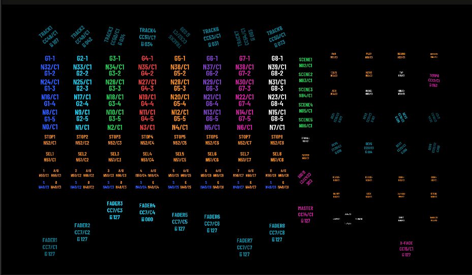

# resolume-cowork-helper-mcp-automation

**An AI agent can build your Resolume compositions and customized controller
shortcut layouts.** The stable release is a complete APC40 mkII visual twin:
148 native Text Animator witnesses driven by a verified 203-shortcut MIDI
preset. The repository also includes reusable prompts, control maps, and
experimental FFT-reactive compositions under `beta/`.

> Tested on Resolume Avenue 7.27 + Resolume MCP 7.26, Windows 11.
> Version drift is real; pin your expectations here.

## What this is

Three things, in Resolume's own terms:

1. **A verified controller visual twin.** `APC40_Visual_QA_148.avc` mirrors
   every physical control without external media. Its matching preset makes
   buttons toggle, faders travel, knobs rotate, and hardware LEDs follow the
   APC40 mkII's actual color capabilities.
2. **Experimental performance instruments.** The earlier React Live and
   Orbit compositions, their controller presets, FFT manifests, and custom
   FFGL plugins remain available under `beta/` and the supporting folders.
   They are useful building material, but their controller pairings are not
   part of the verified stable release.
3. **The prompts and protocols that made both.** Nine copy-paste prompts
   so an agent does the same against YOUR composition and YOUR hardware,
   plus the crash-tested rules for letting an agent drive Avenue at all.

No external clip files are required by the stable visual twin.

## Repo tree

```
resolume-cowork-helper-mcp-automation/
  manifests/    orbit_gen_O1..O5.json - the five decks as machine-readable
                specs: per cell source, FFT band/gain/fallback/floor, mood
                notes, user slots, native fallbacks for custom sources
  prompts/      01-first-contact      - verify the agent<->Resolume loop (5 min)
                02-fft-starter-comp   - build a 4-layer reactive instrument
                03-apc40-layout       - agent WRITES your controller preset
                04-apc-mini-painter   - dual-surface rig + grid painter script
                05-your-clips         - curate + wire YOUR library, safely
                06-custom-ffgl        - build a plugin from the FFGL SDK
                07-orbit-gen-rebuild  - rebuild this whole set from manifests/
                08-your-topic-pack    - ANY topic -> full 4x8-bank-optimized set
                09-any-controller     - bring your own hardware; agent researches
                                        its banks/colors and maps to it
  compositions/ APC40_Visual_QA_148.avc - verified 148-control APC40 twin
  controllers/  APC 40 MK II - Visual QA.xml - verified 203-shortcut preset
  beta/         older React Live + Orbit compositions and controller presets
  docs/         CONTROL_LOGIC.md          - THE control law: safety rails + knob design
                CONTROLLER_VISUAL_TWIN_PLAYBOOK.md - reusable build guide + lessons learned
                APC40_Standard_Layout.md  - beta performance-layout design
                APC40_Control_Map.xlsx    - beta performance map + provenance
                APC40_Standard_Layout.png - one-page readable layout picture
                fft-recipe-card.md        - the wiring convention and why it feels alive
                stability-protocol.md     - how not to crash Avenue while an agent drives
                orbit-placards.md         - the science, scene by scene, read-aloud ready
  LICENSE       MIT
```

## Just want to play? -> [INSTALL.md](INSTALL.md)

One page, four copy-paste steps: composition, plugins, controller preset,
audio. No AI, no coding, ~10 minutes to a lit grid.

## Installing the APC40 mkII shortcuts (never done this before? read this)

The preset is just an XML file you copy into one folder, then pick from a
menu. Step by step:

1. Download `controllers/APC 40 MK II - Visual QA.xml`.
2. Close Resolume if it is running.
3. Open File Explorer (Finder on Mac) and go to your Documents folder,
   then into `Resolume Avenue` > `Shortcuts` > `MIDI`. Notes: if you run
   Arena the folder says `Resolume Arena`; if Windows keeps your Documents
   in OneDrive, it is OneDrive's Documents folder; if `Shortcuts\MIDI`
   does not exist yet, start Resolume once, press Ctrl+M then Escape, and
   the folder appears.
4. Copy the XML file into that `MIDI` folder. That is the whole install.
5. Plug in the APC40 mkII BEFORE starting Resolume, then start Resolume
   and open `compositions/APC40_Visual_QA_148.avc`.
6. In Resolume: Avenue (or Arena) menu > Preferences > MIDI. You will see
   "APC40 mkII" listed as a device. Turn it ON as an input AND as an
   output - both checkboxes. Output is what makes the pads light up.
7. Still in that MIDI preferences panel, choose
   `APC 40 MK II - Visual QA`.
8. Close Preferences and trigger column 1 once if the labels are dark.
   Buttons toggle their matching witnesses; faders move vertically; knobs
   rotate; the crossfader moves horizontally.

If something misbehaves: no lights means output was not enabled (step 6);
wrong clips launching means another app (like Ableton) grabbed the
controller first - close it and power-cycle the APC; the preset missing
from the dropdown means the XML landed in the wrong folder (step 3).
Full troubleshooting: `controllers/INSTALL.md`. The stable control inventory
is in `docs/APC40_Visual_QA_Control_Map.xlsx` and
`docs/APC40_native_addresses.md`.

## Never coded? Start here (the from-zero path)

You do not need to program anything. You type sentences; the agent does the
clicking. Five installs-and-pastes:

1. **Resolume Avenue or Arena 7** - resolume.com (the trial works; it
   watermarks output but everything in this kit functions).
2. **Claude** - either the Claude desktop app (Cowork mode) or Claude Code
   (the terminal version) from claude.com. If a terminal scares you, use
   the desktop app - same brain.
3. **A Resolume MCP server** - this is the adapter that lets the agent see
   and drive Resolume. Search "Resolume MCP" on GitHub or the Resolume
   forum and follow its install steps; in Claude you then add it under
   Settings > Connectors (desktop) or `claude mcp add` (Code). One-time
   setup, roughly ten minutes.
4. Start Resolume with any composition open, even an empty one.
5. Open `prompts/01-first-contact.md` from this kit, copy everything below
   the line, paste it to Claude, and watch it read your rig out loud.
   That is the whole skill. Every other prompt works exactly the same way:
   open file, copy, paste. The agent will ask before it saves anything.

## Quickstart (10 minutes to first light, if you are already set up)

1. Connect your agent to a Resolume MCP; open any comp in Avenue/Arena 7.
2. Run `prompts/01-first-contact.md`. If the reads match your screen, go.
3. Or skip the agent entirely: open
   `compositions/APC40_Visual_QA_148.avc`.
4. Install `controllers/APC 40 MK II - Visual QA.xml`; enable the APC40
   mkII as input AND output; select that preset.
5. Trigger column 1 if needed, then touch the hardware and watch the twin.

## Who this is for

VJs and tinkerers who want a controller twin without hand-building 148
layers and 203 shortcuts. The verified composition and preset work with
zero AI involved; the prompts document how to repeat the method.

## Beta performance experiments

Three Pulse cells reference sources that are not stock Avenue: React Pulsar
(a custom FFGL source - CP1919 pulsar ridgelines, stateless, 7 scalar
params) and two Wire patches (Golden Flicker Reel, Geometry Pattern Maker).
Every such cell is marked `custom_source` with a native `fallback` - the set
plays without them. The React Live and Orbit `.avc` files and their controller
presets are retained under `beta/`; they are not claimed as end-to-end
controller-verified builds. Prompt 06 documents the plugin build path.

## Make your OWN pack (the actual point)

Orbit is one theme: space, told in five physics regimes. The format is the
reusable part - a pack is just five things: themed deck manifests (steal the
JSON schema in `manifests/`, it is self-explanatory), an energy-contour
column order, placards that tell the truth, a matching controller preset,
and the discipline in `docs/`. `prompts/08-your-topic-pack.md` is the
one-paste version: fill in your topic ([deep sea, fungi, Detroit techno
history, the Roman aqueducts...]) and your agent designs, builds,
FFT-wires, and controller-maps the whole set - shaped to the APC40's 4x8
pad bank from the first design decision, placards cited, energy contour
enforced. Not an APC40 owner? `prompts/09-any-controller.md` has the agent
research YOUR hardware's actual banks, buttons, and color system, derive
the grid rule for it, and author the preset to match - plus your own
stated requirements.

Claude is what this kit was built and tested with, but the prompts are
plain text and the manifests are plain JSON - any agent that can drive a
Resolume MCP can play. If you make a pack, publish it the same way this
one shipped: manifests + prompts + preset + placards, no clip files, no
personal paths. That is the whole tradition. Send a link.

## Build a controller visual twin

Start with the
[controller visual-twin playbook](docs/CONTROLLER_VISUAL_TWIN_PLAYBOOK.md).
It turns the APC40 build's failures and fixes into a reusable workflow for any
controller: inventory, manifests, specimen-first XML, a small hardware pilot,
live calibration, extreme-state QA, process hygiene, and rollback. Then give
the [any-controller execution prompt](docs/ANY_CONTROLLER_VISUAL_TWIN_PROMPT.md)
to an agent.

Choose the product deliberately: the beta 91-shortcut performance design
launches and controls a show; the stable 148-control, 203-shortcut Visual QA
preset mirrors the physical surface for diagnosis. A visual twin may
intentionally fan one raw CC into wake, opacity, and motion records. That is
not a duplicate mapping bug, and it does not replace the stricter
performance-preset rules in [Control Logic](docs/CONTROL_LOGIC.md).

The APC40 mkII reference set is the
[ready-to-open composition](compositions/APC40_Visual_QA_148.avc), the
[accepted MIDI preset](controllers/APC%2040%20MK%20II%20-%20Visual%20QA.xml),
the [control-map workbook](docs/APC40_Visual_QA_Control_Map.xlsx), and the
[native address map](docs/APC40_native_addresses.md).



Open the `.avc`, install the matching XML, enable the APC40 mkII as both MIDI
input and output, and select `APC 40 MK II - Visual QA`. The composition has
148 native Text Animator clips, one per physical control, and no external
media dependencies.

## Safety, support, license

The stability protocol in `docs/` is not optional reading - every rule in it
was paid for with a real crash. Saves always require the human's explicit
confirmation; the prompts are written that way on purpose.

As-is, PRs welcome, no support promised. Kit text, manifests, prompts:
MIT (see LICENSE). Placard facts carry their citations inline - corrections
are the most welcome PR of all.
